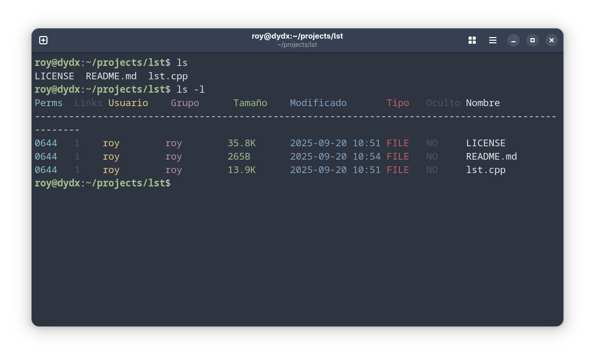

## Custom `ls` command 



Uso:

Compilar primero
```sh
g++ -Wall -std=c++17 lst.cpp -o lst
```

```sh
sudo mv lst /usr/local/bin
```

Funciona exactamente igual que `ls` 

### Usar en lugar de ls

```sh
echo "alias ls='lst'" >> ~/.bashrc && source ~/.bashrc
``` 


